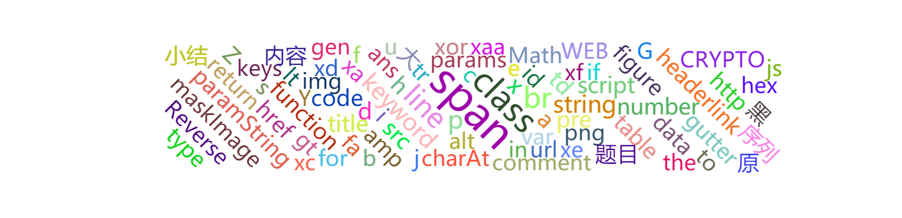

# hexo-generator-wordcloud
## Introduction

generate wordcloud for content

## Install

`npm install hexo-generator-wordcloud --save`

## Usage

modify theme config ,like:

```
echarts: 
  echarts: https://cdn.bootcdn.net/ajax/libs/echarts/4.8.0/echarts.min.js
  echarts_wordcloud: /js/echarts-wordcloud.min.js
```

add tagcode  `` into markdown file

`hexo g`

## Example

